# 🍽️ ConsuSimples

> **Modern, High-Performance Multi-Tenant SaaS for Restaurant, Bar, and Diner Operations.**  
> Built for floor and kitchen efficiency: table & counter orders, kitchen display system (KDS), cashier/POS, and inventory with COGS. Zero bloated third-party delivery overhead, zero client-facing apps, zero complex fiscal invoicing clutter.

**English** | [Português (Brasil)](README.pt-BR.md)

---

[](https://nodejs.org/)
[](https://pnpm.io/)
[](https://turbo.build/repo)
[-black?style=flat-square&logo=next.js&logoColor=white)](https://nextjs.org/)
[](https://react.dev/)
[](https://nestjs.com/)
[](https://www.postgresql.org/)
[](https://www.prisma.io/)
[](https://tailwindcss.com/)
[-3178C6?style=flat-square&logo=typescript&logoColor=white)](https://www.typescriptlang.org/)
[](https://zod.dev/)

---

## 📑 Table of Contents

- [Overview](#-overview)
- [Module Roadmap](#-module-roadmap)
- [Tech Stack](#-tech-stack)
- [Architecture & Engineering Highlights](#-architecture--engineering-highlights)
  - [Strict Multi-Tenant Isolation](#-strict-multi-tenant-isolation)
  - [Authentication & Session Security](#-authentication--session-security)
  - [BFF Pattern & Next.js Frontend](#-bff-pattern--nextjs-frontend)
  - [Financial Precision & Validation](#-financial-precision--validation)
  - [Standardized Error Contracts & Observability](#-standardized-error-contracts--observability)
- [Monorepo Structure](#-monorepo-structure)
- [Getting Started](#-getting-started)
  - [Prerequisites](#prerequisites)
  - [Quickstart Guide](#quickstart-guide)
- [Everyday Commands](#-everyday-commands)
- [Role-Based Access Control (RBAC)](#-role-based-access-control-rbac)
- [Testing Strategy & CI Pipeline](#-testing-strategy--ci-pipeline)
- [Deployment, Backup & Production](#-deployment-backup--production)
- [Code Conventions](#-code-conventions)

---

## 🎯 Overview

**ConsuSimples** addresses the core operational challenges of food service businesses with strict architectural discipline, exceptional performance, and robust security.

- 🏢 **Native Multi-Tenancy:** Complete tenant isolation enforced across database schemas, repository abstractions, and automated test gates.
- ⚡ **Blazing Fast & Fluid:** Next.js 15 (App Router, Server Actions, React 19) + NestJS 11 on Express 5.
- 🔒 **Enterprise-Grade Security:** Cryptographic refresh token rotation with family reuse detection, Argon2id hashing, timing-safe endpoints, sensitive IP-based rate limiting, and nonce-based CSP.
- 🛡️ **Zero "Vibe-Coding":** All critical paths backed by integration tests against real PostgreSQL instances, composite database constraints, and non-negotiable CI security gates.

---

## 🗺️ Module Roadmap

| Module | Description | Status |
|---|---|:---:|
| **1. Base & Catalog** | Multi-tenant auth, public onboarding, user management, RBAC, and product/category catalog. | ✅ **Implemented** |
| **2. Orders & Tabs** | Dine-in tables, counter orders, order items, modifiers, and lifecycle tracking. | ⏱️ *Next Up* |
| **3. Kitchen Display (KDS)** | Real-time preparation queue, priority ordering, item readiness, and dispatch. | 📅 *Planned* |
| **4. Cashier & POS** | Tab settlement, bill splitting, multi-tender payment processing, and shift closeouts. | 📅 *Planned* |
| **5. Inventory & COGS** | Raw ingredients, bill of materials (recipes), automated depletion per sale, and cost analysis. | 📅 *Planned* |

---

## 💻 Tech Stack

```mermaid
flowchart LR
    subgraph Frontend ["Frontend (apps/web)"]
        Next["Next.js 15 App Router"]
        R19["React 19 Server Components"]
        TW["Tailwind CSS v4"]
        BFF["BFF (__Host- HttpOnly Cookies)"]
    end

    subgraph Shared ["Shared (packages/validation)"]
        Zod["Zod 3 Schemas (.strict)"]
    end

    subgraph Backend ["Backend API (apps/api)"]
        Nest["NestJS 11 + Express 5"]
        Pino["Pino Structured Logger"]
        Throttler["Nest Throttler (Rate Limiting)"]
        Prisma["Prisma ORM 6"]
    end

    subgraph Database ["Persistence Layer"]
        PG[("PostgreSQL 17\n(UUIDv7 + Timestamptz)")]
    end

    Frontend -->|Server Actions / fetch| Backend
    Shared -.->|I/O Validation| Frontend
    Shared -.->|DTO Validation| Backend
    Backend -->|Scoped Queries| Database
```



- **Monorepo:** [Turborepo 2](https://turbo.build/) + [pnpm 11](https://pnpm.io/) workspaces.
- **Language & Types:** [TypeScript 5.7](https://www.typescriptlang.org/) in full `strict` mode with `exactOptionalPropertyTypes` and `noUncheckedIndexedAccess`.
- **Backend:** [NestJS 11](https://nestjs.com/), Express 5, [Prisma 6](https://www.prisma.io/), [Argon2](https://github.com/ranisalt/node-argon2), [Pino](https://getpino.io/), [Resend](https://resend.com/).
- **Frontend:** [Next.js 15](https://nextjs.org/) (App Router), [React 19](https://react.dev/), [Tailwind CSS 4](https://tailwindcss.com/).
- **Database:** [PostgreSQL 17](https://www.postgresql.org/) with time-sortable **UUIDv7** primary keys and microsecond timestamps (`Timestamptz(3)`).
- **Shared Validation:** `@consusimples/validation` powered by Zod 3.
- **Testing & Quality:** [Jest](https://jestjs.io/) & [Supertest](https://github.com/ladjs/supertest) (running against a live PostgreSQL container) and [Playwright](https://playwright.dev/) for Web E2E.

---

## 🏛️ Architecture & Engineering Highlights

### 🏢 Strict Multi-Tenant Isolation

We do not rely on implicit memory contexts or magical interceptors. Multi-tenant isolation is guaranteed through three explicit layers of defense:

1. **Typed Scoped Repositories:** Every resource repository method explicitly requires `type Scope = { tenantId: string }` as its first argument. Any method legitimately bypassing tenant scope must carry the `Unscoped` suffix in its name.
2. **Database-Level Defense in Depth (PostgreSQL / Prisma):**
   - Composite unique constraints: `@@unique([tenantId, id])`.
   - Composite Foreign Keys: `products(tenant_id, category_id) → categories(tenant_id, id)`. It is physically impossible at the database level for a product to reference a category from another tenant.
3. **Dedicated Isolation Gate in CI:** The `tenant-isolation.e2e-spec.ts` test suite executes as a mandatory, standalone check in the CI pipeline to prevent cross-tenant data leakage.

### 🔐 Authentication & Session Security

- **Password Hashing:** Argon2id (`m=19456, t=2, p=1`). Login incorporates a `DUMMY_HASH` step when the user does not exist to eliminate timing discrepancies and user enumeration attacks.
- **Access Tokens:** Short-lived JWTs (15 minutes) carrying `{ sub, tenantId, role }` claims.
- **Opaque Refresh Tokens:** High-entropy random tokens (`randomBytes(32).base64url`), stored as SHA-256 hashes in the database with a 30-day lifetime.
- **Family Reuse Detection:** Refresh tokens rotate on every single exchange inside an atomic database transaction. If an already-consumed token is presented (potential token theft), the **entire token family** for that user is immediately revoked (`AUTH_003`).
- **Enumeration-Resistant Endpoints:** Both `signup` and `forgot-password` return identical generic responses regardless of user existence, with email dispatch handled asynchronously.

### 🌐 BFF Pattern & Next.js Frontend

- **Secure Session Management:** Cookies with `__Host-` prefix (`__Host-at` and `__Host-rt`) configured as HttpOnly, Secure, SameSite=Lax, and managed exclusively on the server (`server-only`).
- **Standardized Server Actions:** Schema validation with `schema.safeParse` ➔ backend execution via `apiFetch` ➔ cache invalidation via `revalidatePath` ➔ `redirect()`.
- **Content Security Policy (CSP):** `middleware.ts` generates cryptographic nonces per request to guard inline scripts.
- **Accessibility (A11y):** Native `<dialog>` elements for modals, explicit `aria-invalid` / `aria-describedby` wiring, and semantic status/alert announcements (`role="alert"` and `role="status"`).

### 💰 Financial Precision & Validation

- **Integer Cents for Money:** Prices are exclusively stored and processed as integer cents (`priceCents: Int`). *Never floats, never Decimals.* Currency formatting (`R$`) is strictly confined to presentation helpers (`lib/money.ts`).
- **Zod Strict Schemas:** All schemas in `@consusimples/validation` enforce `.strict()`. Any unexpected payloads (such as an injected `tenantId` in request bodies) immediately trigger `422 Unprocessable Entity` (`VALIDATION_001`).

### 📊 Standardized Error Contracts & Observability

All API error responses adhere to a consistent contract:

```json
{
  "error": {
    "code": "CATALOG_001",
    "message": "A category with this name already exists",
    "details": {},
    "correlationId": "01919a3b-74d1-72bb-8bc1-54a8b79f2203"
  }
}
```

- Accessing resources belonging to another tenant returns **404 (Not Found)** rather than 403, preventing resource discovery.
- Structured JSON logging via **Pino** includes `service`, `version` (Git SHA), and `correlationId` for end-to-end request tracing.

---

## 📂 Monorepo Structure

```
consusimples/
├── apps/
│   ├── api/                     # NestJS 11 + Prisma + Express 5 backend
│   │   ├── prisma/              # PostgreSQL schema & migration files
│   │   ├── src/                 # auth, catalog, users, tenant, health, common, mail
│   │   ├── test/                # E2E and adversarial test suites (Jest + Supertest)
│   │   └── Dockerfile           # Multi-stage production build (Alpine, non-root user)
│   └── web/                     # Next.js 15 (App Router) + React 19 + Tailwind 4 frontend
│       ├── src/app/             # (public): login, signup, etc. | (app): catalog, users
│       ├── src/components/      # Accessible UI components (Button, Field, Modal, Skeleton)
│       ├── src/lib/             # session.ts (cookies), api.ts (BFF fetch), money.ts, errors.ts
│       └── e2e/                 # Web E2E specs (Playwright)
├── packages/
│   └── validation/              # Shared Zod 3 validation schemas (auth, catalog, user, tenant)
├── docs/
│   ├── runbook-deploy.md        # Production operations guide (deploy, rollback, backup, proxy hops)
│   └── superpowers/             # Architecture specs and implementation plans
├── scripts/
│   └── backup-db.sh             # Encrypted off-site database backup (pg_dump | gzip | gpg | rclone)
├── docker-compose.dev.yml       # Local development PostgreSQL 17 (port 5442)
├── docker-compose.prod.yml      # Production stack (migrate + api + postgres)
├── turbo.json                   # Turborepo task pipeline & caching configuration
└── package.json                 # pnpm workspace root configuration
```

---

## 🚀 Getting Started

### Prerequisites

- **Node.js** `>= 22.0.0`
- **pnpm** `^11.0.0` (enable with `corepack enable` or `npm i -g pnpm`)
- **Docker & Docker Compose** (for the local PostgreSQL instance)

### Quickstart Guide

1. **Clone the repository:**
   ```bash
   git clone https://github.com/luscanascimento/consulsimples.git
   cd consulsimples
   ```

2. **Install workspace dependencies:**
   ```bash
   pnpm install --frozen-lockfile
   ```

3. **Configure environment variables:**
   ```bash
   # Root / API environment
   cp .env.example .env

   # Web frontend environment
   cp apps/web/.env.local apps/web/.env.local 2>/dev/null || cat <<EOF > apps/web/.env.local
   API_INTERNAL_URL=http://localhost:3001
   NEXT_PUBLIC_APP_ENV=dev
   EOF
   ```

4. **Start the local PostgreSQL container:**
   ```bash
   pnpm db:up
   ```
   > 💡 The development database listens on port **5442** (`localhost:5442`) to prevent conflicts with native local PostgreSQL services.

5. **Generate Prisma Client and apply migrations:**
   ```bash
   pnpm --filter @consusimples/api exec prisma generate
   pnpm --filter @consusimples/api exec prisma migrate deploy
   ```

6. **Start development servers:**
   ```bash
   # Terminal 1: Start NestJS API (port 3001)
   pnpm --filter @consusimples/api dev

   # Terminal 2: Start Next.js Frontend (port 3000)
   pnpm --filter @consusimples/web dev
   ```

7. **Access in your browser:**
   - 🌐 **Web Application:** [http://localhost:3000](http://localhost:3000)
   - 🩺 **API Health Check:** [http://localhost:3001/health/live](http://localhost:3001/health/live)

---

## 🛠️ Everyday Commands

| Task | Command |
|---|---|
| **Install dependencies** | `pnpm install --frozen-lockfile` |
| **Start local database** | `pnpm db:up` |
| **Stop local database** | `pnpm db:down` |
| **Run Lint (all workspaces)** | `pnpm lint` |
| **Typecheck (TypeScript)** | `pnpm typecheck` |
| **Run Tests (all packages)** | `pnpm test` |
| **Build Monorepo** | `pnpm build` |
| **Run Full CI Pipeline locally** | `pnpm turbo lint typecheck test build` |
| **Start API in dev mode** | `pnpm --filter @consusimples/api dev` |
| **Start Web in dev mode** | `pnpm --filter @consusimples/web dev` |
| **API Integration Tests (Jest + Postgres)** | `pnpm --filter @consusimples/api test` |
| **Tenant Isolation Gate** | `pnpm --filter @consusimples/api test -- tenant-isolation.e2e` |
| **Frontend E2E Tests (Playwright)** | `pnpm --filter @consusimples/web e2e` |
| **Activate Tenant without email verification (Dev)** | `pnpm --filter @consusimples/api run e2e:activate-tenant <email>` |
| **Security Audit** | `pnpm audit --audit-level=high` |

---

## 👥 Role-Based Access Control (RBAC)

The system features 5 explicit roles with strict boundary separation (no implicit hierarchy):

| Role | Target Persona | Key Responsibilities |
|---|---|---|
| **OWNER** | Establishment Owner | Full tenant control, subscription, billing, member invites, and catalog settings. |
| **MANAGER** | Shift / Store Manager | Menu management, product pricing, and user oversight (cannot manage other Owners). |
| **WAITER** | Floor / Service Staff | Catalog browsing, table and counter order placement, order status checks. |
| **KITCHEN** | Kitchen & Bar Staff | Menu reference and active Kitchen Display System (KDS) order preparation queue. |
| **CASHIER** | POS / Checkout Operator | Tab settlement, split payment processing, and shift cash register closures. |

---

## 🧪 Testing Strategy & CI Pipeline

The GitHub Actions workflow (`.github/workflows/ci.yml`) enforces 6 sequential, non-negotiable gates:

1. **Turbo Pipeline:** Linting (`--max-warnings 0`), strict typechecking, and production builds.
2. **Real PostgreSQL Testing:** Full integration and adversarial security test suites against a live PostgreSQL 17 test database.
3. **Tenant Isolation Gate:** Standalone execution of `tenant-isolation.e2e-spec.ts`.
4. **Prisma Drift Check:** Validation of migration status and verification against database drift (`prisma migrate diff`).
5. **Security Audit:** Dependency vulnerability scanning with `pnpm audit --audit-level=high`.
6. **Secret Scanning:** `gitleaks` inspection to prevent hardcoded credentials from entering the codebase.

---

## 🚀 Deployment, Backup & Production

The API is deployed to a client VPS using Docker Compose behind a single TLS-terminating reverse proxy (Caddy or Traefik).

```bash
# 1. Export the current Git commit SHA
export GIT_SHA=$(git rev-parse --short HEAD)

# 2. Build the production API image
docker build -f apps/api/Dockerfile --build-arg GIT_SHA=$GIT_SHA -t consusimples-api:$GIT_SHA .

# 3. Launch the production stack (migrate runs before the API boots)
docker compose -f docker-compose.prod.yml up -d
```

### 🔒 Encrypted Off-Site Backups

The `scripts/backup-db.sh` utility performs PostgreSQL dumps, compresses them, encrypts with **GPG AES256**, and streams the archive to secure off-site cloud storage (Backblaze B2, AWS S3, etc.) via `rclone`:

```bash
# Example Cron setup for daily backup at 03:00 AM
0 3 * * * /opt/consusimples/scripts/backup-db.sh >> /var/log/consusimples-backup.log 2>&1
```

> 📖 For comprehensive instructions on production deployment, `TRUST_PROXY_HOPS` measurement, logging, and database restoration, refer to the [Deployment Runbook](docs/runbook-deploy.md).

---

## 📐 Code Conventions

- **Routes & URLs:** Portuguese `kebab-case` for URLs (e.g., `/cardapio`, `/usuarios`, `?categoria=`).
- **Git Commits:** [Conventional Commits](https://www.conventionalcommits.org/) in English, imperative mood (e.g., `feat(catalog): add category reordering`, `fix(auth): handle token family revocation`).
- **Code Comments:** Focused strictly on explaining the **why** behind non-obvious engineering decisions (security choices, framework pitfalls, database constraints), never restating what the code does.
- **Type Safety:** Zero `any`, strict runtime validation via Zod at the boundaries, and shared typing across backend and frontend.

---

<div align="center">
  <sub>Engineered for simplicity, absolute isolation, and operational excellence.</sub>
</div>
