# 🍽️ ConsuSimples

> **SaaS Multi-tenant de Gerenciamento Essencial para Restaurantes, Bares e Lanchonetes.**  
> Focado na eficiência do salão e da cozinha: comanda, KDS, caixa e estoque. Sem complexidades desnecessárias de delivery externo ou emissão fiscal.

[English](README.md) | **Português (Brasil)**

---

[](https://nodejs.org/)
[](https://pnpm.io/)
[](https://turbo.build/repo)
[-black?style=flat-square&logo=next.js&logoColor=white)](https://nextjs.org/)
[](https://react.dev/)
[](https://nestjs.com/)
[](https://www.postgresql.org/)
[](https://www.prisma.io/)
[](https://tailwindcss.com/)
[-3178C6?style=flat-square&logo=typescript&logoColor=white)](https://www.typescriptlang.org/)
[](https://zod.dev/)

---

## 📑 Índice

- [Visão Geral](#-visão-geral)
- [Roadmap de Módulos](#-roadmap-de-módulos)
- [Tech Stack](#-tech-stack)
- [Arquitetura & Engenharia](#-arquitetura--engenharia)
  - [Isolamento Multi-Tenant Estrito](#-isolamento-multi-tenant-estrito)
  - [Autenticação e Sessão](#-autenticação-e-sessão)
  - [BFF & Frontend Next.js](#-bff--frontend-nextjs)
  - [Precisão Financeira & Validação](#-precisão-financeira--validação)
  - [Contrato de Erros e Observabilidade](#-contrato-de-erros-e-observabilidade)
- [Estrutura do Monorepo](#-estrutura-do-monorepo)
- [Começando (Guia Rápido)](#-começando-guia-rápido)
  - [Pré-requisitos](#pré-requisitos)
  - [Passo a Passo](#passo-a-passo)
- [Comandos do Dia a Dia](#-comandos-do-dia-a-dia)
- [Matriz de Papéis e Permissões (RBAC)](#-matriz-de-papéis-e-permissões-rbac)
- [Estratégia de Testes e CI](#-estratégia-de-testes-e-ci)
- [Deploy, Backup e Produção](#-deploy-backup-e-produção)
- [Convenções de Código](#-convenções-de-código)

---

## 🎯 Visão Geral

O **ConsuSimples** foi projetado para resolver a dor real de estabelecimentos gastronômicos com máxima simplicidade operacional, robustez e alta performance.

- 🏢 **Multi-Tenant Nativo:** Cada restaurante/lanchonete opera com isolamento absoluto de dados.
- ⚡ **Rápido e Fluido:** Frontend com Next.js 15 Server Actions e React 19 + API em NestJS 11 com Express 5.
- 🔒 **Segurança Corporativa:** Sessões com rotação de refresh token criptográfico, detecção de reuso em família, hashes Argon2id, rate limiting sensível e CSP rigorosa com nonce.
- 🛡️ **Zero Vibe-Coding:** Engenharia orientada a testes reais contra PostgreSQL, chaves compostas no banco e gates inegociáveis de isolamento e auditoria no CI.

---

## 🗺️ Roadmap de Módulos

| Módulo | Descrição | Status |
|---|---|:---:|
| **1. Base & Catálogo** | Auth multi-tenant, onboarding, usuários, papéis (RBAC) e catálogo de produtos/categorias. | ✅ **Implementado** |
| **2. Comanda & Pedidos** | Mesas e balcão, lançamento de itens, modificadores e controle de estados do pedido. | ⏱️ *Próximo* |
| **3. KDS Cozinha** | Fila de preparo em tempo real, priorização, marcação de pronto e despacho. | 📅 *Planejado* |
| **4. Caixa & Fechamento** | Fechamento de contas, divisão de pagamentos, métodos múltiplos e fechamento de turno. | 📅 *Planejado* |
| **5. Estoque & CMV** | Cadastro de insumos, ficha técnica por produto, baixa automática por venda e custo da mercadoria vendida. | 📅 *Planejado* |

---

## 💻 Tech Stack

```mermaid
flowchart LR
    subgraph Frontend ["Frontend (apps/web)"]
        Next["Next.js 15 App Router"]
        R19["React 19 Server Components"]
        TW["Tailwind CSS v4"]
        BFF["BFF (HttpOnly __Host- Cookies)"]
    end

    subgraph Shared ["Compartilhado (packages/validation)"]
        Zod["Zod 3 Schemas (.strict)"]
    end

    subgraph Backend ["Backend API (apps/api)"]
        Nest["NestJS 11 + Express 5"]
        Pino["Pino Structured Logger"]
        Throttler["Nest Throttler (Rate Limit)"]
        Prisma["Prisma ORM 6"]
    end

    subgraph Database ["Persistência"]
        PG[("PostgreSQL 17\n(UUIDv7 + Timestamptz)")]
    end

    Frontend -->|Server Actions / fetch| Backend
    Shared -.->|Validação de I/O| Frontend
    Shared -.->|Validação de DTOs| Backend
    Backend -->|Queries Escopadas| Database
```



- **Monorepo:** [Turborepo 2](https://turbo.build/) + [pnpm 11](https://pnpm.io/) workspaces.
- **Linguagem & Tipagem:** [TypeScript 5.7](https://www.typescriptlang.org/) em modo `strict` com `exactOptionalPropertyTypes` e `noUncheckedIndexedAccess`.
- **Backend:** [NestJS 11](https://nestjs.com/), Express 5, [Prisma 6](https://www.prisma.io/), [Argon2](https://github.com/ranisalt/node-argon2), [Pino](https://getpino.io/), [Resend](https://resend.com/).
- **Frontend:** [Next.js 15](https://nextjs.org/) (App Router), [React 19](https://react.dev/), [Tailwind CSS 4](https://tailwindcss.com/).
- **Banco de Dados:** [PostgreSQL 17](https://www.postgresql.org/) com IDs em **UUIDv7** (ordenáveis cronologicamente) e `Timestamptz(3)`.
- **Validação Compartilhada:** `@consusimples/validation` com Zod 3.
- **Qualidade & Testes:** [Jest](https://jestjs.io/), [Supertest](https://github.com/ladjs/supertest) (com PostgreSQL real) e [Playwright](https://playwright.dev/) para E2E web.

---

## 🏛️ Arquitetura & Engenharia

### 🏢 Isolamento Multi-Tenant Estrito

Não confiamos apenas em memória ou middlewares mágicos. A segurança multi-tenant opera em três camadas:

1. **Repositórios com Assinatura Tipada:** Todo método de repositório de recurso recebe explicitamente `type Scope = { tenantId: string }` como primeiro argumento. Métodos que legitimamente não exigem escopo são nomeados com sufixo `Unscoped`.
2. **Defesa em Profundidade no Banco (PostgreSQL/Prisma):**
   - Chaves compostas obrigatórias: `@@unique([tenantId, id])`.
   - Foreign Keys compostas entre tabelas filhas: `products(tenant_id, category_id) → categories(tenant_id, id)`. É impossível no nível relacional um produto referenciar a categoria de outro tenant.
3. **Gate Automatizado de Isolamento:** A suíte `tenant-isolation.e2e-spec.ts` é executada como um gate obrigatório e isolado no CI para barrar qualquer vazamento entre contas.

### 🔐 Autenticação e Sessão

- **Senhas:** Criptografadas com `argon2id` (`m=19456, t=2, p=1`). O login utiliza `DUMMY_HASH` quando o email não existe para mitigar ataques de timing e enumeração.
- **Access Tokens:** JWT com claim `{ sub, tenantId, role }` e validade curta de **15 minutos**.
- **Refresh Tokens Opostos e Criptográficos:** Tokens opacos gerados via `randomBytes(32).base64url`, armazenados no banco como SHA-256 hex, válidos por **30 dias**.
- **Detecção de Reuso em Família:** Rotação de refresh token a cada chamada via transação atômica. Se um token já consumido for apresentado, a **família inteira** de tokens do usuário é revogada imediatamente (`AUTH_003`).
- **Proteção contra Enumeração:** Endpoints de `signup` e `forgot-password` retornam exatamente a mesma resposta genérica, e envios de email ocorrem em background assíncrono.

### 🌐 BFF & Frontend Next.js

- **Sessão Segura:** Cookies HttpOnly, Secure, SameSite=Lax com prefixo `__Host-` (`__Host-at` e `__Host-rt`) manipulados exclusivamente no servidor (`server-only`).
- **Server Actions Padronizadas:** Tratamento tipado via `schema.safeParse` ➔ execução no backend via `apiFetch` ➔ `revalidatePath` ➔ `redirect()`.
- **Content Security Policy (CSP):** `middleware.ts` injeta nonces criptográficos em cada requisição para proteger scripts.
- **Acessibilidade:** Formulários com `aria-invalid`, `aria-describedby`, alerts semânticos (`role="alert"` e `role="status"`), e diálogos nativos `<dialog>`.

### 💰 Precisão Financeira & Validação

- **Dinheiro em Centavos:** Preços são armazenados e manipulados **estritamente em inteiros** (`priceCents: Int`). *Nunca float, nunca Decimal.* A conversão visual para `R$` ocorre apenas na camada de apresentação (`lib/money.ts`).
- **Zod Strict Schemas:** Todos os schemas em `@consusimples/validation` utilizam `.strict()`. Qualquer tentativa de injeção de campos extras (inclusive `tenantId` no corpo de requisições) resulta em erro imediato `422 Unprocessable Entity` (`VALIDATION_001`).

### 📊 Contrato de Erros e Observabilidade

Todas as respostas de erro da API seguem rigorosamente o formato:

```json
{
  "error": {
    "code": "CATALOG_001",
    "message": "Já existe uma categoria com este nome",
    "details": {},
    "correlationId": "01919a3b-..."
  }
}
```

- Tentativa de acesso a recurso de outro tenant retorna **404 (Not Found)**, nunca 403, evitando confirmação de existência.
- Logs estruturados em JSON via **Pino**, com `service`, `version` (Git SHA) e `correlationId` para rastreamento ponta a ponta.

---

## 📂 Estrutura do Monorepo

```
consusimples/
├── apps/
│   ├── api/                     # Backend NestJS 11 + Prisma + Express 5
│   │   ├── prisma/              # Schema PostgreSQL e migrations
│   │   ├── src/                 # auth, catalog, users, tenant, health, common, mail
│   │   ├── test/                # Suítes E2E e testes adversariais (Jest + Supertest)
│   │   └── Dockerfile           # Multi-stage production build (Alpine, non-root)
│   └── web/                     # Frontend Next.js 15 (App Router) + React 19 + Tailwind 4
│       ├── src/app/             # (public): entrar, cadastrar, etc. | (app): cardapio, usuarios
│       ├── src/components/      # Componentes acessíveis (Button, Field, Modal, Skeleton)
│       ├── src/lib/             # session.ts (cookies), api.ts (BFF fetch), money.ts, errors.ts
│       └── e2e/                 # Testes E2E com Playwright
├── packages/
│   └── validation/              # Schemas Zod 3 compartilhados (auth, catalog, user, tenant)
├── docs/
│   ├── runbook-deploy.md        # Guia completo de deploy, rollback, backup e medição de proxy
│   └── superpowers/             # Specs e planos de implementação dos módulos
├── scripts/
│   └── backup-db.sh             # Backup off-site cifrado (pg_dump | gzip | gpg | rclone)
├── docker-compose.dev.yml       # PostgreSQL 17 local de desenvolvimento (porta 5442)
├── docker-compose.prod.yml      # Stack de produção (migrate + api + postgres)
├── turbo.json                   # Pipeline de build e cache Turborepo
└── package.json                 # Configurações do workspace pnpm
```

---

## 🚀 Começando (Guia Rápido)

### Pré-requisitos

- **Node.js** `>= 22.0.0`
- **pnpm** `^11.0.0` (instale com `corepack enable` ou `npm i -g pnpm`)
- **Docker & Docker Compose** (para o PostgreSQL local)

### Passo a Passo

1. **Clone o repositório:**
   ```bash
   git clone https://github.com/luscanascimento/consulsimples.git
   cd consulsimples
   ```

2. **Instale as dependências:**
   ```bash
   pnpm install --frozen-lockfile
   ```

3. **Configure as variáveis de ambiente:**
   ```bash
   # Configuração geral / API
   cp .env.example .env

   # Configuração do Web
   cp apps/web/.env.local apps/web/.env.local 2>/dev/null || cat <<EOF > apps/web/.env.local
   API_INTERNAL_URL=http://localhost:3001
   NEXT_PUBLIC_APP_ENV=dev
   EOF
   ```

4. **Inicie o PostgreSQL de desenvolvimento:**
   ```bash
   pnpm db:up
   ```
   > 💡 O banco local roda na porta **5442** (`localhost:5442`) para evitar conflitos com instâncias locais do Postgres.

5. **Gere o Prisma Client e aplique as migrations:**
   ```bash
   pnpm --filter @consusimples/api exec prisma generate
   pnpm --filter @consusimples/api exec prisma migrate deploy
   ```

6. **Inicie os servidores de desenvolvimento:**
   ```bash
   # Terminal 1: Iniciar a API (porta 3001)
   pnpm --filter @consusimples/api dev

   # Terminal 2: Iniciar o Frontend Web (porta 3000)
   pnpm --filter @consusimples/web dev
   ```

7. **Acesse no navegador:**
   - 🌐 **Web App:** [http://localhost:3000](http://localhost:3000)
   - 🩺 **API Health Check:** [http://localhost:3001/health/live](http://localhost:3001/health/live)

---

## 🛠️ Comandos do Dia a Dia

| Ação | Comando |
|---|---|
| **Instalar dependências** | `pnpm install --frozen-lockfile` |
| **Subir banco local** | `pnpm db:up` |
| **Parar banco local** | `pnpm db:down` |
| **Executar Lint (todo o repo)** | `pnpm lint` |
| **Checagem de Tipos (TypeScript)** | `pnpm typecheck` |
| **Rodar Testes (todos os pacotes)** | `pnpm test` |
| **Build do Monorepo** | `pnpm build` |
| **Pipeline do CI localmente** | `pnpm turbo lint typecheck test build` |
| **Rodar API em desenvolvimento** | `pnpm --filter @consusimples/api dev` |
| **Rodar Web em desenvolvimento** | `pnpm --filter @consusimples/web dev` |
| **Testes E2E da API (Jest + Postgres)** | `pnpm --filter @consusimples/api test` |
| **Gate de Isolamento Multi-Tenant** | `pnpm --filter @consusimples/api test -- tenant-isolation.e2e` |
| **Testes E2E do Frontend (Playwright)** | `pnpm --filter @consusimples/web e2e` |
| **Ativar Tenant sem confirmar email (Dev)** | `pnpm --filter @consusimples/api run e2e:activate-tenant <email>` |
| **Auditoria de Vulnerabilidades** | `pnpm audit --audit-level=high` |

---

## 👥 Matriz de Papéis e Permissões (RBAC)

O sistema conta com 5 papéis predefinidos sem herança implícita:

| Papel | Descrição | Permissões Principais |
|---|---|---|
| **OWNER** (Dono) | Proprietário do estabelecimento | Gestão total do tenant, faturamento, membros e catálogo. |
| **MANAGER** (Gerente) | Gerente operacional | Gestão de cardápio, categorias e usuários (exceto outros Owners). |
| **WAITER** (Garçom) | Atendimento e salão | Consulta ao cardápio, lançamento e acompanhamento de comandas/mesas. |
| **KITCHEN** (Cozinha) | Equipe de preparo | Visualização do cardápio e operação da fila do KDS. |
| **CASHIER** (Caixa) | Operador de caixa | Fechamento de contas, recebimentos e controle de caixa. |

---

## 🧪 Estratégia de Testes e CI

O pipeline de Integração Contínua (`.github/workflows/ci.yml`) opera com 6 gates estritos e sequenciais:

1. **Turbo Pipeline:** Lint (`--max-warnings 0`), Typecheck e Builds sem falhas.
2. **PostgreSQL Real:** Testes de integração e segurança contra instância de teste do Postgres 17.
3. **Tenant Isolation Gate:** Execução dedicada de `tenant-isolation.e2e-spec.ts`.
4. **Prisma Drift Check:** `prisma migrate status` e verificação de schema drift (`prisma migrate diff`).
5. **Security Audit:** `pnpm audit --audit-level=high`.
6. **Secret Scanning:** `gitleaks` para garantir que nenhum segredo seja commitado.

---

## 🚀 Deploy, Backup e Produção

O deploy da API é realizado em VPS própria com Docker Compose e terminação TLS via Reverse Proxy (Caddy ou Traefik).

```bash
# 1. Exportar a tag do commit atual
export GIT_SHA=$(git rev-parse --short HEAD)

# 2. Construir a imagem da API
docker build -f apps/api/Dockerfile --build-arg GIT_SHA=$GIT_SHA -t consusimples-api:$GIT_SHA .

# 3. Subir o stack de produção (migrations rodam antes da API inicializar)
docker compose -f docker-compose.prod.yml up -d
```

### 🔒 Backup Off-Site Cifrado

O script `scripts/backup-db.sh` realiza dumps do PostgreSQL, comprime, cifra via **GPG AES256** e envia para bucket remoto seguro (Backblaze B2, S3, etc.) via `rclone`:

```bash
# Execução agendada via Cron (exemplo diário às 03:00)
0 3 * * * /opt/consusimples/scripts/backup-db.sh >> /var/log/consusimples-backup.log 2>&1
```

> 📖 Para instruções completas de deploy, medição de `TRUST_PROXY_HOPS`, observabilidade e procedimento de restore, consulte o [Runbook de Deploy](docs/runbook-deploy.md).

---

## 📐 Convenções de Código

- **Rotas e URLs:** Em português e `kebab-case` (ex.: `/cardapio`, `/usuarios`, `?categoria=`).
- **Commits:** [Conventional Commits](https://www.conventionalcommits.org/) em inglês, no imperativo (ex.: `feat(catalog): add category reordering`, `fix(auth): handle token family revocation`).
- **Comentários:** Em português, focados estritamente no **porquê** de decisões não óbvias (segurança, constraints do banco ou armadilhas de runtime), nunca no óbvio.
- **Tipagem Segura:** Sem uso de `any`, validação via Zod na borda e tipagem compartilhada entre frontend e backend.

---

<div align="center">
  <sub>Construído com foco em simplicidade, segurança e alta performance operacional.</sub>
</div>
